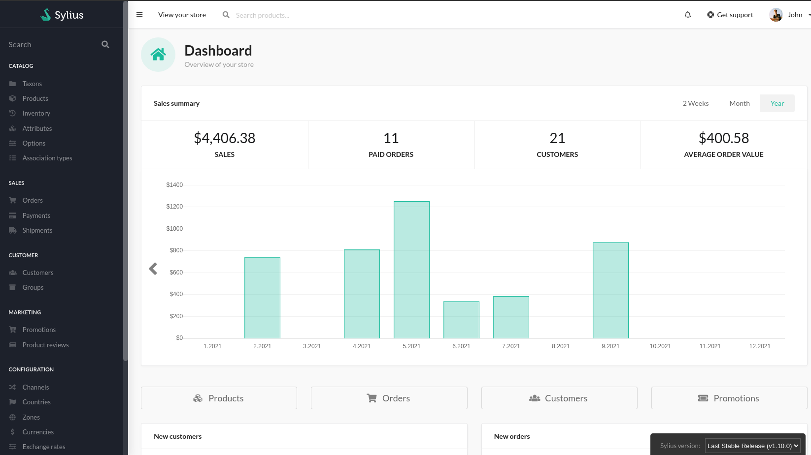
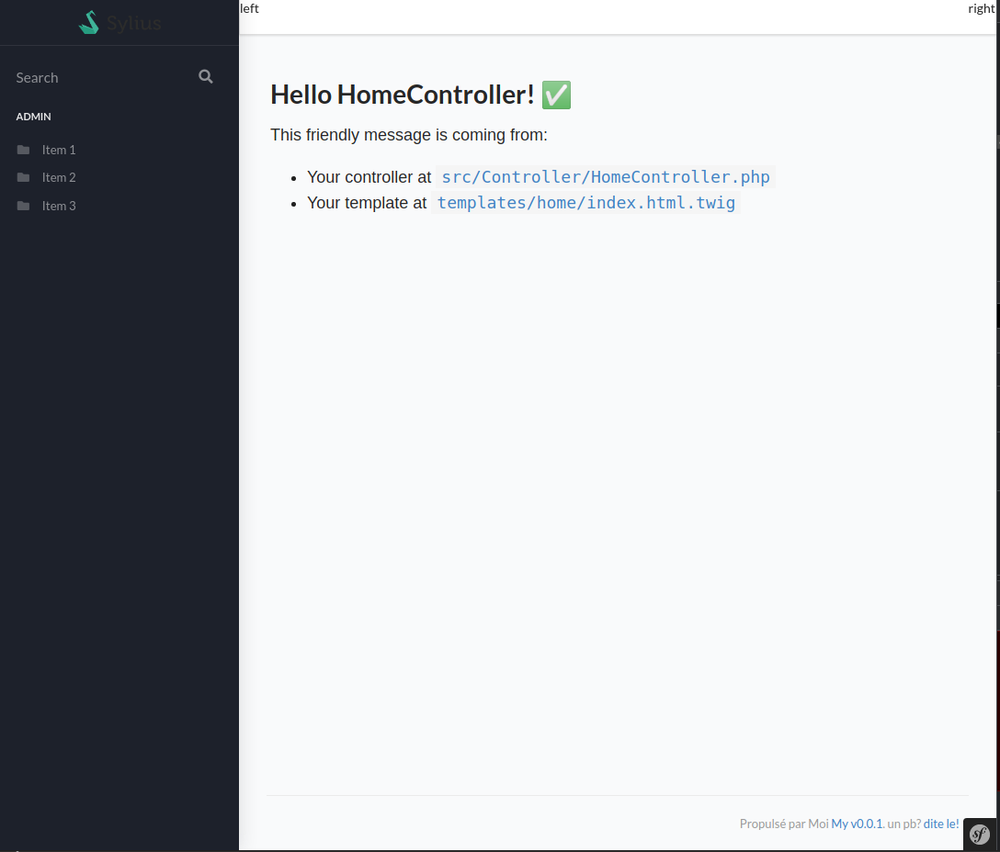

# Sylius Admin Style sans e-commerce

Ce projet est un POC pour utiliser les bundles de Sylius en dehors d'un projet Sylius.

Fait avec :heart:

* Premier article [décrivant l'origine et le découlement du développement](https://nahan.fr/demarrage-dun-projet-de-hack-de-sylius/) de ce projet.

# Etape 1

Avoir une interface qui ressemble à l'admin de Sylius.

Sylius

Résultat de la première étape :

# Etape 2

Utiliser le Ressource Bundle de Sylius pour gérer des données avec les grilles du SyliusGridBundle.

